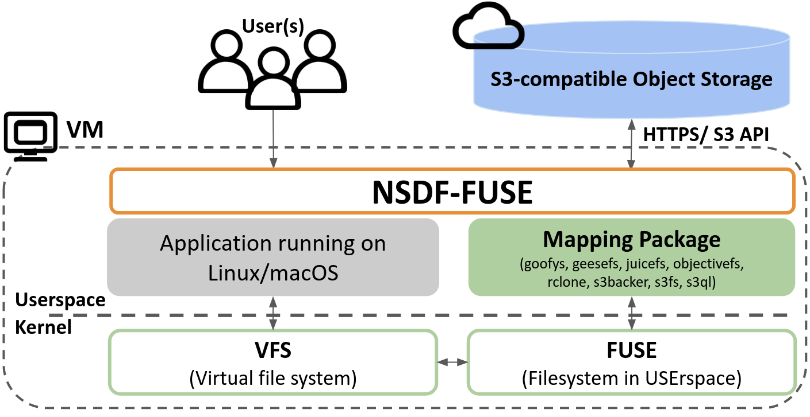

# NSDF-Fuse

This repository is made of a single bash script `nsdf-fuse` to mount/unmount, test, install, benchmark *S3-compatible Object Storage* mounted as a FUSE filesystem.

We don't expect the file system to be 100% POSIX compliant.

We know mounting S3 as a file system is suboptimal (see [this link](https://www.reddit.com/r/aws/comments/dplfoa/why_is_s3fs_such_a_bad_idea/)); we know that using S3 API is the best in the S3-API world.

Nevertheless we investigate here how Object Storage as a FUSE file system behaves.

  
_NSDF-FUSE, a testbed for evaluating settings and performance of FUSE-based file systems on top of S3-compatible object storage._

## FUSE software solutions

Specific instructions for specific vendors are contained inside `scripts/` directory.

For example inside the `scripts/geesefs.sh`
you will find code to mount/unmount using the GeeseFS solution.

The considered solutions are:

* `GeeseFS` *a good FUSE FS implementation over S3* (link https://github.com/yandex-cloud/geesefs)
* `Goofys` *a high-performance, POSIX-ish Amazon S3 file system written in Go* (link: https://github.com/kahing/goofys)
* `JuiceFs` *a distributed POSIX file system built on top of Redis and S3* (link: JuiceFS is a distributed POSIX file system built on top of Redis and S3.)
* `ObjectiveFS` *a shared file system that scales automatically, with unlimited storage and high performance* (link: https://objectivefs.com/)
* `RClone` *a rsync for cloud storage* (link: https://github.com/rclone/rclone)
* `S3Backer` *a FUSE-based single file backing store via Amazon S3* (link: https://github.com/archiecobbs/s3backer)
* `S3FS` *a FUSE-based file system backed by Amazon S3* (link: https://github.com/s3fs-fuse/s3fs-fuse)
* `S3QL` *a full featured file system for online data storage* (link: [https://github.com/s3ql/s3ql](https://github.com/s3ql/s3ql))

<br>
## Test insights

The benchmark are not meant to be optimized for showing the effectiveness of caching. On the contrary we are tyring to simulate use cases where data is not cached, with a *cold-like access*, like what happens after a reboot, and a brand new mount of the bucket.

Our tests focus on:

* **sequential write** with just one writer with big `1GiB+` files
* **sequential read** with just one reader with big `1GiB+` files
* **sequential write** with multiple `8+` writers concurrently accessing big `1GiB+` files
* **sequential read** with multiple `8+` readers concurrently accessing big `1GiB+` file
* **random writes** with multiple `16+` writers accessing small `64KiB+` files
* **random reads** with multiple `16+` readers () accessing small `64KiB+` files

In our tests, the same file should not be accessed twice to avoid any caching factor. Where it's not possible to disable caching, cache files are setup to be minimal.

Some additional notes/considerations/comments:

* there are some very dangerous script command that could be run (e.g.,`clean-all`).
    * It'a better to use an S3 accounts where you are sure you can afford to loose all your data.
* We are more interested in *reading* than *writing*
    * without some locking-mechanism (or journaled file system) it is impossible to have concurrent writing on the same data without incurring in corrupted data
* `fio` tests  led inconsistent results.
    * This could be related to the fact that we don't have any control on operations going on internally and it's difficult to control the caching effect.
    * for example when `fio` is "layouting file" it could be that it is already caching the data in RAM/DISK cache.
* We prefer *free-to-use* solutions.
    * The only *pay-per-use* solution in our list is `ObjectiveFS` (see [here](https://objectivefs.com/price?l=pricing) for pricing)
* We prefer *serverless solution* to cut down maintenance costs or hardware costs.
    * The only `server-full` solution here is `JuiceFs`, that is using a noSQL Redis database for metadata storage.
* All tests are repeated at least 3+ times.
    * This is to avoid the [cloud noisy neighbor problem](https://www.techtarget.com/searchcloudcomputing/definition/noisy-neighbor-cloud-computing-performance).
* To have even more real numbers we need to repeat the same tests multiple times, in different days/regions/platforms/hour ranges etc.
* All tests are run in one region near the the Virtual Machine (VM) .
    * For example if the data is stored in the `us-east-1` region, then the FUSE file system is mounted on a VM in the same region.
    * We don't care too much here about latency induced by geographic distance
    * we want to show the intrinsic limitation induced by the FUSE mounting itself.

## Preliminary setup

We need a AWS S3 account to run all test.

**Make sure you are using an account with no meaningful data i.e. you can afford to loose all your buckets during the benchmarks**.

All the tests use one Amazon S3 endpoint. In the future we can generalize the code to use different endpoints from different vendors (e.g. Wasabi/OSN).

To start tests we first need to specify the security credentials (**note: this is a very unsecure way**).


Amazon:

```
# change as needed
export AWS_ACCESS_KEY_ID=XXXXX
export AWS_SECRET_ACCESS_KEY=YYYYY
export AWS_DEFAULT_REGION_REGION=us-east-1
export AWS_S3_ENDPOINT_URL=https://s3.${AWS_DEFAULT_REGION}.amazonaws.com
```

Wasabi:

```
# change as needed
export AWS_ACCESS_KEY_ID=XXXXX
export AWS_SECRET_ACCESS_KEY=YYYYY
export AWS_DEFAULT_REGION=us-west-1
export AWS_S3_ENDPOINT_URL=https://s3.${AWS_DEFAULT_REGION}.wasabisys.com
```


### (OPTIONAL) ObjectiveFS setup

To test ObjectiveFS you need to register [here](https://objectivefs.com/account/signup?l=signup). Pricing details are available [here](https://objectivefs.com/price?l=pricing). But you can create a *14-days try-and-buy version*. At the end of the registration process you will get a licence to be specified on your terminal (change as needed):

```
# change as needed
export OBJECTIVEFS_LICENSE=ZZZZZ
```

### (OPTIONAL) JuiceFS setup

To test JuiceFs you will need a Redis server for metadata. 

You could use a [JuiceFS Cloud Software as a Service Service](https://juicefs.com/docs/cloud/) that is free up to `1TiB` with 10 mounts (see [pricing link](https://juicefs.com/pricing)). 

After the registration you need to create a `File System` in [https://juicefs.com/console/](https://juicefs.com/console/) named `nsdf-fuse-test-juicefs`. 

The default is using AWS as endpoint, but if you want for example use another endpoint (like Wasabi or IBM cloud) you must manually set it in the UI.

Go to the *Advanced Settings* and remove the `juicefs-` prefix.

Other settings (such as Block size=4MB and Compression=lz4) should be fine.


Then setup the JuiceFS token into your terminal:

```
export JUICE_TOKEN=KKKKK
```


## nsdf-fuse command explanation

Create a Virtual Machine as near as possible to your buckets; for example you create the VM in the `us-east-1` region and the bucket in the same `us-east-1` region.

Clone this repository:

```
git clone https://github.com/nsdf-fabric/nsdf-fuse
cd nsdf-fuse

# this is needed to call nsdf-fuse command without the ./ prefix
export PATH=$PWD:$PATH
```

Setup your VM with all the dependencies, assuming you are under `Ubuntu 20.x` you can do:

```
nsdf-fuse update-os
```

Install the FUSE software binaries (replace TARGET with any of `geesefs`, `goofys` ... see `scripts directory for allowed names):

```
# change as needed
export TARGET=geesefs
nsdf-fuse install
```

To test your credentials list all buckets:

```
nsdf-fuse list-buckets
```

To create a new bucket named `nsdf-fuse-test-$TARGET` you do:

```
nsdf-fuse create-bucket

# check the bucket was created
nsdf-fuse list-buckets
```

To mount the new bucket as a FUSE file system:

```
nsdf-fuse up

# you should see the new file system listed here
mount
```

To create a random file (useful for testing purpouse):

```
nsdf-fuse touch
```

To list all files inside the bucket:

```
nsdf-fuse find
```

To unmount the FUSE file system and remove all cache so far created (thus simulating later a cold boot):

```
nsdf-fuse down
```

To completely remove the test bucket (NOTE: this will destroy all the data inside it!):

```
nsdf-fuse remove-bucket

# check the bucket is removed
nsdf-fuse list-buckets
```

A last and **VERY DANGEROUS** command is the `clean-all` command. It will remove all buckets starting with the name `nsdf-fuse-test`. And it will recursively remove all files in \`/tmp/nsdf-fuse' directory:

```
# *** very very DANGEROUS ***
nsdf-fuse clean-all
```


## Quick tests


Then you can repeat the test for a specific targets.

```
# change as needed
export TARGET=geesefs
nsdf-fuse install

# simple (bash-based) tests
# first you remove anything from last tests
# then create a bucket for the testing
# and finally run the real tests
nsdf-fuse clean-all && 
  nsdf-fuse create-bucket && 
  nsdf-fuse simple-benchmark 
```

## S3QL specific

`s3ql` is the only not compatible with other tests since it is using `fuse3` vs the normal `fuse`. 
For this reason it is probably better to run `s3ql` test at the end. You first install `s3ql`:

```
export TARGET=s3ql
nsdf-fuse install
```

Then you can run the `s3sq` tests as described above.

And finally you may want to uninstall it:

```
nsdf-fuse uninstall

# you need to install `fuse` back for other targets
nsdf-fuse update-os
```

## Other useful commands


```
# Check network traffic
nload -u M -U M

# Check drive usage:
df -h

# Check directory usage:
sudo du -sh /* 2>/dev/null

# Reclaim space for deleted files:
sudo lsof | grep deleted 
sudo kill -9 1889585

```


# Next

- [ ] Add a pass-through FUSE file system like [StackFS](https://github.com/sbu-fsl/fuse-stackfs/blob/master/StackFS_LowLevel/StackFS_LowLevel.c) and record all file access. This way we can tell post-execution what is the best way to mount the data
- [ ] Create an automatic pipeline to repeat all the tests every N days
- [ ] Write papers
- [ ] Create a full-fledged SDK to simplify the mounting process
- [ ] Verify compatibility with Windows (WebDav?)


